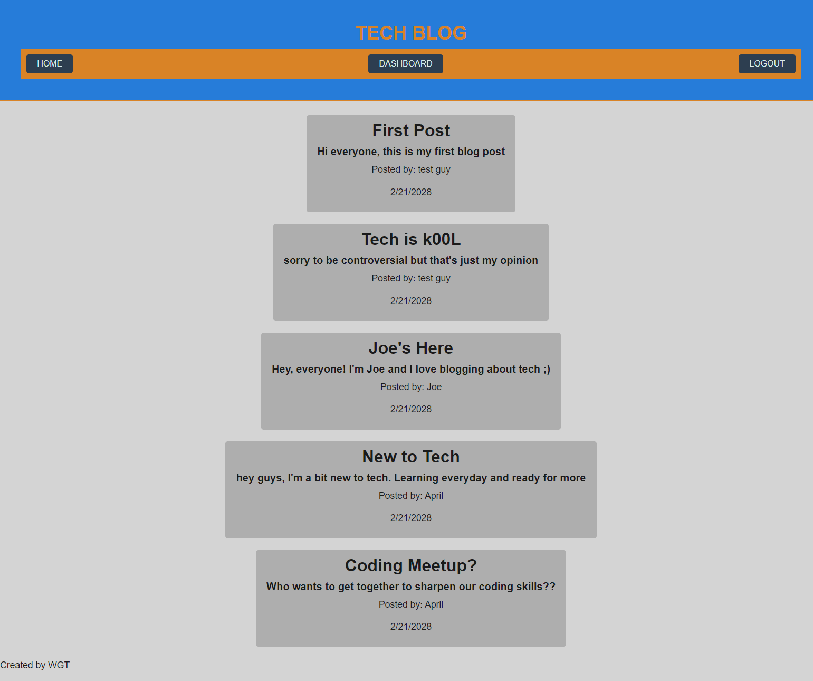

# TECH BLOG
  
  # Description 
  A simple text-based blog for sharing thoughts on tech
  # Table of Contents 
  * [Usage](#usage)
  * [Contributing](#contributing)
  * [Questions](#questions)
  * [Link](#link)
  * [Screenshot](#screenshot)

  # Usage 
  After creating an account, users can add posts and comments to existing posts. They can then manage their existing posts from their user dashboard
  
  # Contributing 
  William George Thomas
  # Tests 
  
  # Questions 
  For further information:
 
  * GitHub:
    * [https://github.com/WilliamGeorgeThomas](https://github.com/WilliamGeorgeThomas)
 
  * Email:
    * williamgeorgethomas@gmail.com

# Link

[https://wgt-tech-blog.herokuapp.com/](https://wgt-tech-blog.herokuapp.com/)

# Screenshot

